# AEAT Clave PIN: Weak Authentication Flow

> **Scope**: This document describes the *weak authentication* (autenticacion debil)
> flow used by the AEAT Clave PIN mobile application to register a new device via
> DNI/NIE + SMS verification. This is the primary onboarding path for Spanish
> taxpayers who want to use the Clave Movil system.

---

## Table of Contents

1. [Overview](#overview)
2. [Terminology](#terminology)
3. [Infrastructure & Subdomains](#infrastructure--subdomains)
4. [Client Identity: User-Agent & Headers](#client-identity-user-agent--headers)
5. [Cookie Management](#cookie-management)
6. [The TrazasApp Header](#the-trazasapp-header)
7. [Full Authentication Flow](#full-authentication-flow)
   - [Phase 1: DNI/NIE Auth + SMS Request](#phase-1-dninie-auth--sms-request)
   - [Phase 2: SMS Validation + Device Activation](#phase-2-sms-validation--device-activation)
8. [Sequence Diagram](#sequence-diagram)
9. [Step-by-Step HTTP Details](#step-by-step-http-details)
   - [Step 0: ClaveStartingSv](#step-0-clavestartingsv)
   - [Step 1: AutenticaDniNieContrasteh](#step-1-autenticadnniecontrasteh)
   - [Step 2: ClaveRequestStateSv](#step-2-claverequeststatessv)
   - [Step 3: ObtenerClaveMovilSMS](#step-3-obtenerclavemovilsms)
   - [Step 4: ValidarClaveMovilSMS](#step-4-validarclavemovilsms)
   - [Step 5: ClaveActivateAuthenticationSv](#step-5-claveactivateauthenticationsv)
10. [Cookie Lifecycle Diagram](#cookie-lifecycle-diagram)
11. [Redirect Chain Detail](#redirect-chain-detail)
12. [Response Envelope Format](#response-envelope-format)
13. [Session Persistence](#session-persistence)
14. [Error Handling](#error-handling)
15. [Critical Implementation Notes](#critical-implementation-notes)
16. [Endpoint Reference Table](#endpoint-reference-table)
17. [Architecture Diagram](#architecture-diagram)

---

## Overview

The AEAT (Agencia Estatal de Administracion Tributaria) provides a mobile
authentication system called **Clave PIN** / **Clave Movil** that allows Spanish
citizens to authenticate with government services. The system is accessed via the
official Android/iOS app "Cl@ve PIN".

**Weak authentication** (autenticacion debil) is the process of proving identity
using data printed on a physical DNI (Documento Nacional de Identidad) or NIE
(Numero de Identidad de Extranjero) card, combined with SMS verification to the
registered phone number. This is "weak" compared to certificate-based
authentication because it only proves possession of the card data — not
cryptographic identity.

The flow has **two phases**:

1. **Phase 1** — DNI/NIE credentials establish a session, then an SMS code is
   sent to the registered mobile.
2. **Phase 2** — The user enters the SMS code, which is validated, and then the
   device is activated (registered) with the AEAT backend.

```
┌──────────────┐     ┌──────────────┐     ┌──────────────┐
│  User's DNI  │     │ User's Phone │     │  AEAT Server │
│  (physical)  │     │  (receives   │     │  (www2/www6/  │
│              │     │   SMS code)  │     │   www12)      │
└──────┬───────┘     └──────┬───────┘     └──────┬───────┘
       │                    │                     │
       │  NIF + date +      │                     │
       │  soporte number    │                     │
       └────────────────────┼────────────────────>│
                            │     SMS code        │
                            │<────────────────────│
                            │                     │
                            │  Enter SMS code     │
                            │────────────────────>│
                            │                     │
                            │  Device activated!  │
                            │<────────────────────│
```

---

## Terminology

| Term | Description |
|------|-------------|
| **NIF** | Numero de Identificacion Fiscal. The Spanish tax ID number (8 digits + letter for DNI, or X/Y/Z + 7 digits + letter for NIE). |
| **DNI** | Documento Nacional de Identidad. The Spanish national ID card. |
| **NIE** | Numero de Identidad de Extranjero. Foreign national identification number in Spain. |
| **Soporte** | The support/serial number printed on the physical DNI/NIE card. |
| **Fecha** | The date of validity or date of birth, formatted as `DD-MM-YYYY`. |
| **Autenticacion debil** | "Weak authentication" — identity proven via card data (NIF + fecha + soporte) rather than a digital certificate. |
| **Clave PIN** | A temporary 4-digit PIN valid for ~5 minutes, used for one-time authentication to government services. |
| **Clave Movil** | The mobile-based authentication system. The app on the user's device. |
| **device_id** | A server-generated UUID identifying the activated device. |
| **device_password** | A client-generated UUID used as a shared secret between device and server. |
| **pin24H** | A session cookie set after SMS validation. Required for device activation on www6. Named for the original 24-hour validity window. |
| **TrazasApp** | A custom HTTP header containing serialised cookie diagnostic information, mimicking the Android app's internal telemetry. |

---

## Infrastructure & Subdomains

AEAT distributes its mobile API across three subdomains, each backed by separate
WebSphere Application Server clusters:

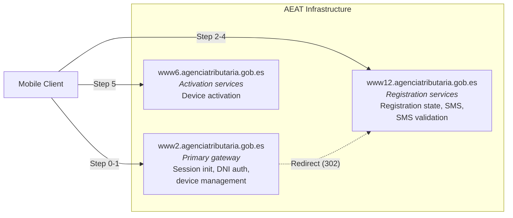

| Subdomain | Base URL | Role |
|-----------|----------|------|
| **www2** | `https://www2.agenciatributaria.gob.es` | Primary entry point. Handles session initialization (`ClaveStartingSv`), DNI/NIE authentication (`AutenticaDniNieContrasteh`), and most device management endpoints. |
| **www12** | `https://www12.agenciatributaria.gob.es` | Registration and SMS services. Handles registration state checks (`ClaveRequestStateSv`), SMS code requests (`ObtenerClaveMovilSMS`), and SMS validation (`ValidarClaveMovilSMS`). |
| **www6** | `https://www6.agenciatributaria.gob.es` | Device activation. Handles the final activation step (`ClaveActivateAuthenticationSv`). |

All endpoints live under the `/wlpl/MOVI-P24H/` path (mobile operations),
except the DNI/NIE authentication which uses `/wlpl/BUCV-JDIT/`
(identity verification subsystem).

> **Critical**: Each subdomain runs a separate WebSphere cluster with separate
> `JSESSIONID` namespaces. A `JSESSIONID` from www2 **must not** be sent to www6
> — doing so causes www6 to return its homepage HTML instead of processing the
> API request.

---

## Client Identity: User-Agent & Headers

The AEAT server validates the client identity through the `User-Agent` header.
The format must exactly match the official Android app:

```
APPMovil/Cl@ve/v{version}({build})/{os_version}/Android/{dalvik_agent}
```

Concrete value used:

```
APPMovil/Cl@ve/v6.2.5(288)/14/Android/Dalvik/2.1.0 (Linux; U; Android 14; SM-S928U Build/UP1A.231005.007)
```

| Component | Value | Source |
|-----------|-------|--------|
| App identifier | `APPMovil/Cl@ve` | Hardcoded in app |
| Version | `v6.2.5(288)` | `APP_VERSION` = `6.2.5`, build 288 |
| OS version | `14` | Android 14 |
| Platform | `Android` | Hardcoded |
| Dalvik agent | `Dalvik/2.1.0 (Linux; U; Android 14; SM-S928U Build/UP1A.231005.007)` | `System.getProperty("http.agent")` on Android |

> **Critical**: The full Dalvik user-agent suffix (including the parenthetical
> with Linux, device model, and build number) is **required**. A truncated
> User-Agent (e.g., just `APPMovil/Cl@ve/v6.2.5(288)/14/Android/Dalvik/2.1.0`)
> causes the server's WAF to reject the request with a "Pagina no habilitada en
> internet publico" (page not enabled on public internet) error page. This was
> one of the hardest issues to diagnose during reverse engineering.

### Default Headers

Every request includes:

| Header | Value |
|--------|-------|
| `User-Agent` | Full Android app user agent (see above) |
| `Accept` | `application/json` |
| `Accept-Language` | `es_ES` |
| `Cookie` | All managed cookies (see [Cookie Management](#cookie-management)) |
| `TrazasApp` | JSON cookie diagnostic object (see [The TrazasApp Header](#the-trazasapp-header)) |

---

## Cookie Management

The client manages cookies **manually** across all three AEAT subdomains. This is
necessary because:

1. The Android app uses `CookiePolicy.ACCEPT_ALL` which forwards all cookies to
   all subdomains regardless of domain-matching rules.
2. Standard HTTP clients (like reqwest) follow RFC domain-matching rules, which
   would prevent cookies set by `www2` from being sent to `www6` or `www12`.
3. The server relies on cookies being forwarded cross-domain (e.g., `WWW12` set
   during DNI auth on www2 must reach www6 for activation).

### Cookie Store Design

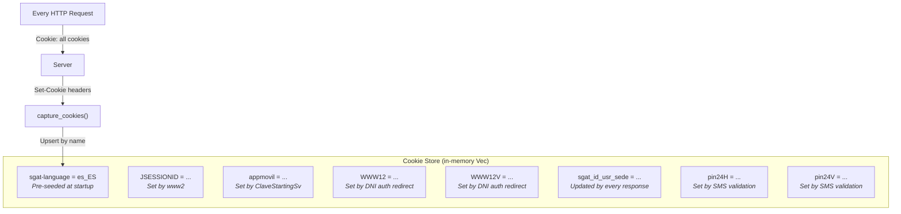

### Key Cookies

| Cookie | Set By | Purpose | Required For |
|--------|--------|---------|--------------|
| `sgat-language` | Pre-seeded at client startup | Language preference (`es_ES`) | All requests |
| `appmovil` | `ClaveStartingSv` response | Base64-encoded JSON identifying the app version, OS, and device model | All subsequent requests |
| `JSESSIONID` | www2 during DNI auth | WebSphere session affinity for www2 cluster | www2 requests only. **Must be stripped for www6.** |
| `WWW12` | DNI auth redirect chain | Authentication token for www12 | www12 and www6 endpoints |
| `WWW12V` | DNI auth redirect chain | Timestamp companion to `WWW12` | www12 and www6 endpoints |
| `sgat_id_usr_sede` | Updated by most responses | JSON-encoded session state (access type, timestamp, user name) | All requests (informational) |
| `pin24H` | `ValidarClaveMovilSMS` response | Proof of SMS verification. Long encrypted token. | **Device activation on www6** |
| `pin24V` | `ValidarClaveMovilSMS` response | Timestamp companion to `pin24H` | Device activation on www6 |

### Cookie Propagation Rules

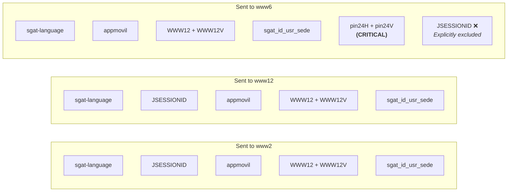

---

## The TrazasApp Header

Every request includes a custom `TrazasApp` header containing a JSON object that
mirrors the Android app's internal `getCookiesInApp()` method. This header
serialises the current cookie state for server-side diagnostics and legitimacy
checks.

### Structure

```json
{
  "cookiesWww1Gestor":          "{CERT_WWW1} y {CERT_WWW1V}",
  "cookiesWww6Gestor":          "{pin24H} y {pin24V}",
  "cookiesWww12Gestor":         "{WWW12} y {WWW12V}",
  "cookiesAppMovilGestor":      "{appmovil}",
  "cookiesSgatLanguageGestor":  "{sgat-language}",
  "cookiesWww1Local":           "{CERT_WWW1} y {CERT_WWW1V}",
  "cookiesWww6Local":           "{pin24H} y {pin24V}",
  "cookiesWww12Local":          "{WWW12} y {WWW12V}",
  "cookiesAppMovilLocal":       "{appmovil}",
  "cookiesSgatLanguageLocal":   "{sgat-language}"
}
```

- **`*Gestor`** fields: Cookie values from the app's cookie jar (runtime).
- **`*Local`** fields: Cookie values from the device's keychain storage (persisted).
  In practice, both contain the same values.
- **`" y "` separator**: Cookie value pairs are joined with the literal string ` y `
  (Spanish for "and").
- **`"null"`**: When a cookie is not set, its value is the literal string `"null"`.

### Example (early in flow, before SMS validation)

```json
{
  "cookiesWww1Gestor":          "null y null",
  "cookiesWww6Gestor":          "null y null",
  "cookiesWww12Gestor":         "4C8937...== y 20260310-15105322",
  "cookiesAppMovilGestor":      "eyJhcHAiOiJjbGF2ZSI...",
  "cookiesSgatLanguageGestor":  "es_ES",
  "cookiesWww1Local":           "null y null",
  "cookiesWww6Local":           "null y null",
  "cookiesWww12Local":          "4C8937...== y 20260310-15105322",
  "cookiesAppMovilLocal":       "eyJhcHAiOiJjbGF2ZSI...",
  "cookiesSgatLanguageLocal":   "es_ES"
}
```

---

## Full Authentication Flow

### Phase 1: DNI/NIE Auth + SMS Request

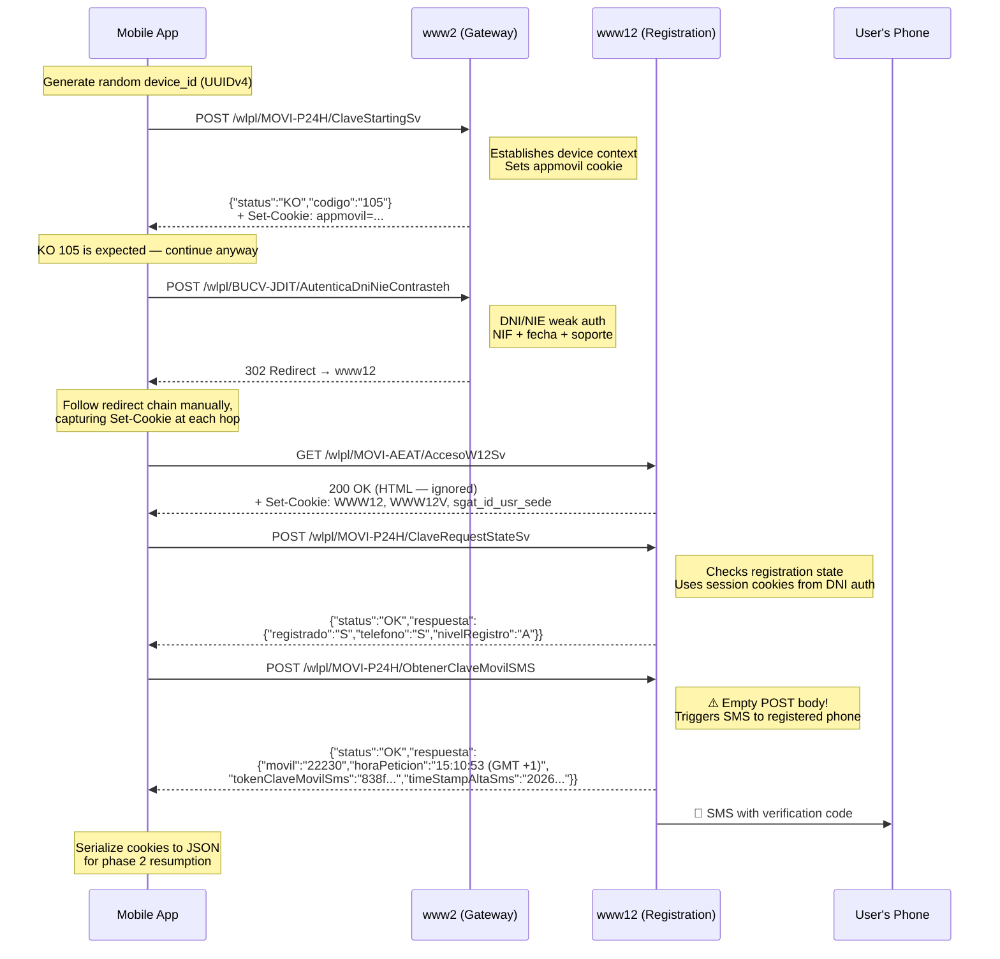

### Phase 2: SMS Validation + Device Activation

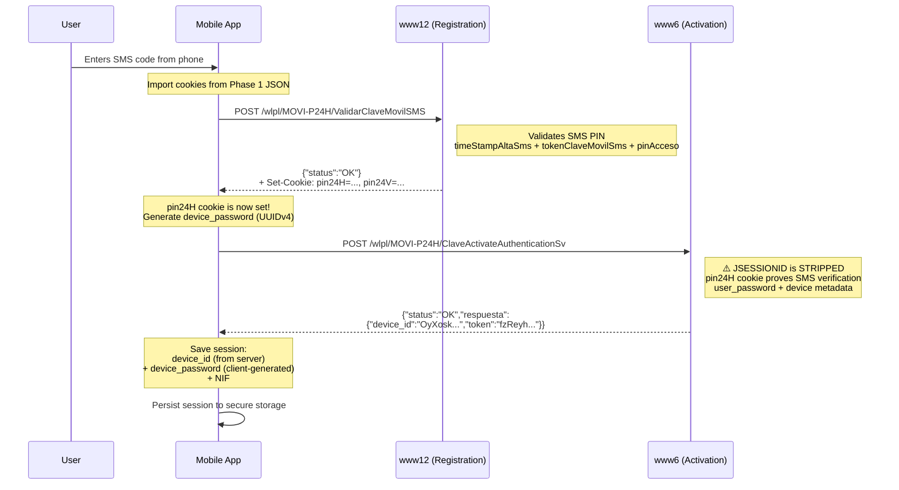

---

## Sequence Diagram

### Complete End-to-End Flow

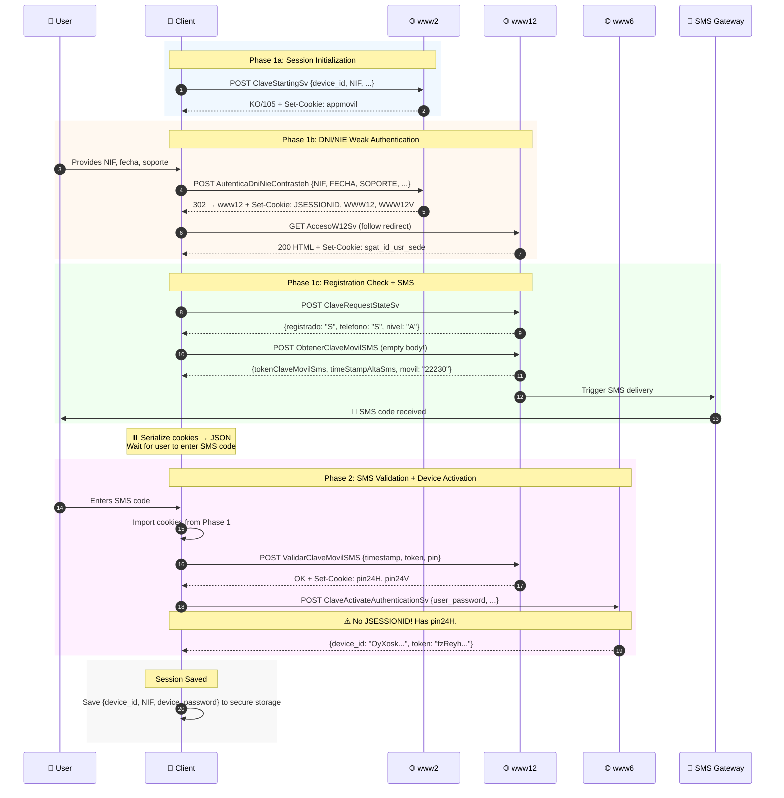

---

## Step-by-Step HTTP Details

### Step 0: ClaveStartingSv

**Purpose**: Establish device context with the AEAT backend. Sets the `appmovil`
cookie, which is required by subsequent endpoints.

| Property | Value |
|----------|-------|
| **Method** | `POST` |
| **URL** | `https://www2.agenciatributaria.gob.es/wlpl/MOVI-P24H/ClaveStartingSv` |
| **Content-Type** | `application/x-www-form-urlencoded` |
| **Required Cookies** | `sgat-language` (pre-seeded) |

**Form Parameters**:

| Parameter | Description | Example |
|-----------|-------------|---------|
| `device_id` | Random UUIDv4 | `601a4147-fcd3-4c6a-9a9d-e627ca86deb8` |
| `NIF` | User's tax ID | `09030055W` |
| `sistema_operativo` | OS identifier | `A` (Android) |
| `token_push` | Firebase push token | `""` (empty for initial setup) |
| `version_os` | OS version | `14` |
| `version_app` | App version | `6.2.5` |
| `modelo` | Device model | `SM-S928U` |

**Response**: JSON with `status` field.

```json
{
  "status": "KO",
  "codigo_error": "105",
  "mensaje": "?",
  "visible": "N",
  "crashlytics": "N"
}
```

> **Note**: A `KO` response with code `105` is **expected and normal** during
> initial registration. The important side effect is the `appmovil` Set-Cookie
> header. The flow continues regardless of this response status.

**Cookies Set**: `appmovil` (Base64-encoded JSON):

```json
// Decoded appmovil value:
{
  "app": "clave",
  "version_app": "6.2.5",
  "sistema_operativo": "A",
  "version_os": "14",
  "modelo": "SM-S928U"
}
```

---

### Step 1: AutenticaDniNieContrasteh

**Purpose**: Authenticate using DNI/NIE card data. This is the "weak
authentication" step — it proves the caller has the physical card's printed data.
The response body is HTML and is completely ignored. Only the **cookies set during
the redirect chain** matter.

| Property | Value |
|----------|-------|
| **Method** | `POST` |
| **URL** | `https://www2.agenciatributaria.gob.es/wlpl/BUCV-JDIT/AutenticaDniNieContrasteh?ref=%2Fwlpl%2FMOVI-AEAT%2FAccesoW12Sv` |
| **Content-Type** | `application/x-www-form-urlencoded` |
| **Required Cookies** | `sgat-language`, `appmovil` |

**Form Parameters**:

| Parameter | Value | Description |
|-----------|-------|-------------|
| `NIF` | e.g. `09030055W` | Spanish tax ID number |
| `FECHA` | e.g. `15-06-2025` | Date of validity (DNI) or date of birth (NIE), format `DD-MM-YYYY` |
| `SOPORTE` | e.g. `BAA123456` | Support/serial number from the physical card |
| `botonAutenticacionDebil` | `Continuar` | Literal string — identifies this as weak auth |
| `APP` | `S` | Indicates mobile app context |
| `modo` | `json` | Request JSON-mode (though response is still HTML) |
| `AZUL` | `""` | Empty — reserved for certificate auth |
| `FECHANIE` | `""` | Empty — reserved for NIE-specific date |

**Response Handling**:

This endpoint **does not return JSON**. It returns HTML and triggers a redirect
chain. The client must:

1. **Disable automatic redirects** (reqwest's auto-redirect strips custom headers
   on cross-origin redirects).
2. **Follow each redirect manually**, re-attaching `Cookie` and `TrazasApp`
   headers at every hop.
3. **Capture `Set-Cookie` headers** from every response in the chain.
4. **Count redirects** — zero redirects means auth failed (server returned the
   login form again).

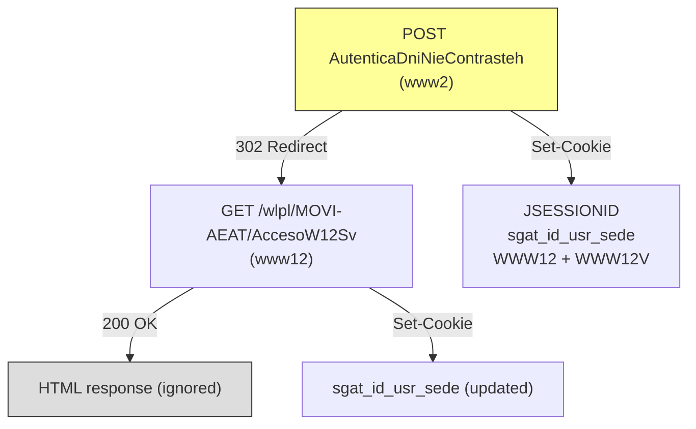

**Cookies Set During Redirect Chain**:
- `JSESSIONID` — www2 WebSphere session
- `WWW12` — Authentication token (long encrypted string)
- `WWW12V` — Timestamp for WWW12 (format: `YYYYMMDD-HHmmssSSS`)
- `sgat_id_usr_sede` — URL-encoded JSON with session info

**Failure Detection**: If the redirect count is 0, the server returned the login
form again, which means the credentials (NIF, fecha, or soporte) were rejected.
This is reported as `DniAuthFailed`.

---

### Step 2: ClaveRequestStateSv

**Purpose**: Check the user's registration state after DNI authentication. This
confirms whether the user has a registered phone number and their access level.

| Property | Value |
|----------|-------|
| **Method** | `POST` |
| **URL** | `https://www12.agenciatributaria.gob.es/wlpl/MOVI-P24H/ClaveRequestStateSv` |
| **Content-Type** | `application/x-www-form-urlencoded` |
| **Required Cookies** | All cookies from Steps 0-1 (especially `WWW12`, `WWW12V`, `sgat_id_usr_sede`) |

**Form Parameters**:

| Parameter | Value | Description |
|-----------|-------|-------------|
| `sistema_operativo` | `A` | Android |
| `version_os` | `14` | OS version |
| `version_app` | `6.2.5` | App version |

> **Note**: No `device_id` or `NIF` is sent. The server identifies the user
> entirely from the session cookies established by DNI authentication.

**Response**:

```json
{
  "status": "OK",
  "visible": "N",
  "crashlytics": "N",
  "respuesta": {
    "registrado": "S",
    "nivelRegistro": "A",
    "telefono": "S"
  }
}
```

| Field | Values | Meaning |
|-------|--------|---------|
| `registrado` | `"S"` / `"N"` | Whether the user has a registered device (Si/No) |
| `nivelRegistro` | `"A"`, `"B"`, etc. | Registration level (A = highest) |
| `telefono` | `"S"` / `"N"` | Whether a phone number is registered |

---

### Step 3: ObtenerClaveMovilSMS

**Purpose**: Trigger an SMS verification code to the user's registered phone
number.

| Property | Value |
|----------|-------|
| **Method** | `POST` |
| **URL** | `https://www12.agenciatributaria.gob.es/wlpl/MOVI-P24H/ObtenerClaveMovilSMS` |
| **Content-Type** | **None** (empty body) |
| **Required Cookies** | All cookies from Steps 0-2 |

> **Critical**: This endpoint **must** be called with an **empty POST body** and
> **no Content-Type header**. The Android app uses Retrofit's `@POST` annotation
> **without** `@FormUrlEncoded`, which results in `Content-Length: 0` and no
> `Content-Type`. Sending form-encoded data (even empty) causes error code
> `902024`.

**Request Body**: Empty string (`""`) — produces `Content-Length: 0`.

**Response**:

```json
{
  "status": "OK",
  "visible": "N",
  "crashlytics": "N",
  "respuesta": {
    "tokenClaveMovilSms": "838f5824490558cc6c456e550ae7b6c2...",
    "timeStampAltaSms": "20260310151053593031",
    "movil": "22230",
    "horaPeticion": "15:10:53 (GMT +1)"
  }
}
```

| Field | Description |
|-------|-------------|
| `tokenClaveMovilSms` | Hex token uniquely identifying this SMS session. Must be sent back in Step 4. |
| `timeStampAltaSms` | Server timestamp of the SMS request. Must be sent back in Step 4. |
| `movil` | Last 5 digits of the registered phone number (masked for display to user). |
| `horaPeticion` | Human-readable time of the SMS request (for display to user). |

At this point, the user's phone receives an SMS with a verification code.

**Phase 1 ends here.** The client serialises all cookies to JSON so they can be
restored in Phase 2 (after the user enters the SMS code).

---

### Step 4: ValidarClaveMovilSMS

**Purpose**: Validate the SMS code entered by the user. On success, the server
sets the `pin24H` and `pin24V` cookies, which are the proof-of-SMS-verification
required for device activation.

| Property | Value |
|----------|-------|
| **Method** | `POST` |
| **URL** | `https://www12.agenciatributaria.gob.es/wlpl/MOVI-P24H/ValidarClaveMovilSMS` |
| **Content-Type** | `application/x-www-form-urlencoded` |
| **Required Cookies** | All cookies from Phase 1 (imported from serialised JSON) |

**Form Parameters**:

| Parameter | Description | Example |
|-----------|-------------|---------|
| `timeStampAltaSms` | Server timestamp from Step 3 | `20260310151053593031` |
| `tokenClaveMovilSms` | SMS session token from Step 3 | `838f5824490558cc6c456e550ae7b6c2...` |
| `pinAcceso` | The SMS code entered by the user | `123456` |

**Response**:

```json
{
  "status": "OK",
  "visible": "N",
  "crashlytics": "N"
}
```

**Cookies Set**:
- `pin24H` — Long encrypted token proving SMS verification
- `pin24V` — Timestamp companion (format: `YYYYMMDD-HHmmssSSS`)
- `JSESSIONID` — New session ID for www12

> **This is the pivotal step.** The `pin24H` cookie is the "gate" that allows
> device activation. Without it, `ClaveActivateAuthenticationSv` (Step 5) will
> return HTML instead of JSON.

---

### Step 5: ClaveActivateAuthenticationSv

**Purpose**: Activate (register) the device with the AEAT backend. Returns a
server-generated `device_id` that uniquely identifies this device for future
authentication.

| Property | Value |
|----------|-------|
| **Method** | `POST` |
| **URL** | `https://www6.agenciatributaria.gob.es/wlpl/MOVI-P24H/ClaveActivateAuthenticationSv` |
| **Content-Type** | `application/x-www-form-urlencoded` |
| **Required Cookies** | All cookies **except JSESSIONID** |

> **Critical**: The `JSESSIONID` from www2/www12 **must be explicitly excluded**
> from the Cookie header. www6 runs a separate WebSphere cluster, and receiving
> an unrecognised `JSESSIONID` causes it to return its homepage instead of
> processing the API request.

**Form Parameters**:

| Parameter | Description | Example |
|-----------|-------------|---------|
| `sistema_operativo` | OS identifier | `A` |
| `version_os` | OS version | `14` |
| `version_app` | App version | `6.2.5` |
| `token_push` | Firebase push token | `""` (empty) |
| `user_password` | Client-generated password (UUIDv4) | `a1b2c3d4-...` |
| `modelo` | Device model | `SM-S928U` |

**Required Cookie Analysis**:

```
Cookie: sgat-language=es_ES;
        sgat_id_usr_sede={...};
        appmovil={base64};
        WWW12={encrypted};
        WWW12V={timestamp};
        pin24H={encrypted};    ← REQUIRED — proves SMS was verified
        pin24V={timestamp}     ← REQUIRED — companion to pin24H
```

**Response**:

```json
{
  "status": "OK",
  "visible": "N",
  "crashlytics": "N",
  "respuesta": {
    "device_id": "OyXoskiz6fLnzd080Xxzrpr40",
    "token": "fzReyhbEtsPqdfXfDM8P9Zs9rSSKwEu9eLobA1SK3L4sAzpe7zUhifV8pG0kaC8PBw3LQeul5gAeV7Kgy9Itr1qZsRouQSe0P0HbgBtrZuTCP0jRmiJauakeHWrMxb2WcIhE3NAD4Jlz76tRlzPSxSmL53STAQ5uXhFyJmZy4pBAKFfZX70KtDBFcuWMPdL"
  }
}
```

| Field | Description |
|-------|-------------|
| `device_id` | Server-generated unique device identifier. Stored in session for all future API calls. |
| `token` | Activation token (usage TBD — possibly for push notification registration). |

**After activation**, the session is saved:

```json
{
  "device_id": "OyXoskiz6fLnzd080Xxzrpr40",
  "nif": "09030055W",
  "device_password": "a1b2c3d4-e5f6-7890-abcd-ef1234567890",
  "firebase_token": null,
  "created_at": "2026-03-10T14:11:16.999Z"
}
```

---

## Cookie Lifecycle Diagram

This diagram shows which cookies exist at each point in the flow:

```mermaid
gantt
    title Cookie Lifecycle During Authentication
    dateFormat X
    axisFormat %s

    section sgat-language
    Pre-seeded at startup       :active, 0, 6

    section appmovil
    Set by ClaveStartingSv      :active, 1, 6

    section JSESSIONID
    Set by DNI auth             :active, 2, 5
    Stripped for www6            :crit, 5, 6

    section WWW12 + WWW12V
    Set during DNI redirect     :active, 2, 6

    section sgat_id_usr_sede
    Set during DNI redirect     :active, 2, 6

    section pin24H + pin24V
    Set by SMS validation       :active, 4, 6

    section Step Markers
    0 ClaveStartingSv           :milestone, 0, 0
    1 AutenticaDniNie           :milestone, 1, 1
    2 ClaveRequestState         :milestone, 2, 2
    3 ObtenerSMS                :milestone, 3, 3
    4 ValidarSMS                :milestone, 4, 4
    5 ActivateAuth              :milestone, 5, 5
```

---

## Redirect Chain Detail

The DNI/NIE authentication (Step 1) involves a critical redirect chain that
crosses subdomain boundaries. Understanding this chain is essential because
cookies are captured at each hop:

```mermaid
sequenceDiagram
    participant Client
    participant www2 as www2 (BUCV-JDIT)
    participant www12 as www12 (MOVI-AEAT)

    Client->>www2: POST /wlpl/BUCV-JDIT/AutenticaDniNieContrasteh?ref=...
    Note right of www2: Validates NIF + FECHA + SOPORTE<br/>against citizen database

    www2-->>Client: 302 Found<br/>Location: /wlpl/MOVI-AEAT/AccesoW12Sv<br/>Set-Cookie: JSESSIONID=...<br/>Set-Cookie: sgat_id_usr_sede=...<br/>Set-Cookie: WWW12=...<br/>Set-Cookie: WWW12V=...

    Note over Client: Re-attach ALL cookies<br/>+ TrazasApp header

    Client->>www12: GET /wlpl/MOVI-AEAT/AccesoW12Sv<br/>Cookie: sgat-language; JSESSIONID; appmovil; WWW12; WWW12V; sgat_id_usr_sede
    www12-->>Client: 200 OK<br/>Content-Type: text/html<br/>Set-Cookie: sgat_id_usr_sede=... (updated)

    Note over Client: HTML body is IGNORED<br/>Only cookies matter
```

**Why manual redirect following is required**:

1. `reqwest` (and most HTTP clients) strip custom headers like `Cookie` and
   `TrazasApp` on cross-origin redirects for security reasons.
2. The redirect goes from `www2` to `www12` — different origins.
3. The server expects cookies to be present on the redirected request.
4. Without manual redirect handling, the www12 request arrives with no cookies,
   and the server returns a login page instead of setting session cookies.

---

## Response Envelope Format

All AEAT API endpoints (except `AutenticaDniNieContrasteh` which returns HTML)
use a standard JSON response envelope:

```json
{
  "status": "OK",
  "visible": "N",
  "crashlytics": "N",
  "codigo_error": null,
  "mensaje": null,
  "respuesta": { ... }
}
```

| Field | Type | Description |
|-------|------|-------------|
| `status` | `string` | `"OK"` for success, `"KO"` for error |
| `visible` | `string?` | `"N"` — controls UI visibility of error messages |
| `crashlytics` | `string?` | `"N"` — controls whether to report to Crashlytics |
| `codigo_error` | `string?` | Error code (e.g., `"105"`, `"902024"`) |
| `mensaje` | `string?` | Human-readable error message (Spanish) |
| `respuesta` | `T?` | Endpoint-specific response payload |

### Common Error Codes

| Code | Meaning | Cause |
|------|---------|-------|
| `105` | Session not established | Expected from `ClaveStartingSv` during new registration |
| `902024` | Invalid request format | Sending form data to `ObtenerClaveMovilSMS` (must be empty POST) |
| HTML response | Session expired / missing cookies | Server returns login page instead of JSON |

---

## Session Persistence

After successful device activation, the session is persisted for future use
(requesting PINs, checking pending authentications, etc.):

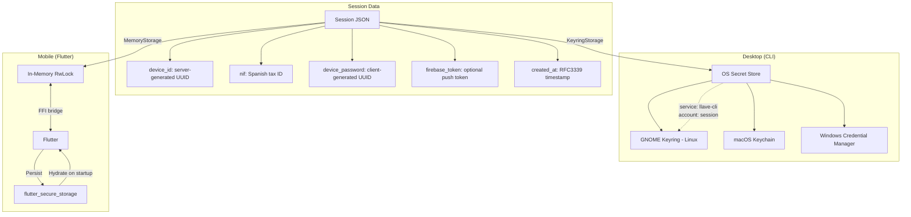

### Session Lifecycle

1. **Creation**: After `ClaveActivateAuthenticationSv` returns `device_id`.
2. **Storage**: Serialised as JSON and saved to platform-specific secure storage.
3. **Usage**: Loaded for subsequent operations (PIN requests, auth confirmation).
4. **Deletion**: On explicit deactivation or logout.

### FFI Bridge Pattern

For mobile (Flutter) apps, the session crosses the Rust/Dart boundary:

```
Flutter startup:
  1. flutter_secure_storage.read("session") → JSON
  2. FFI call: set_session_data(json) → Rust MemoryStorage

After activation:
  1. Rust saves to MemoryStorage
  2. FFI call: export_session() → JSON
  3. Flutter: flutter_secure_storage.write("session", json)
```

---

## Error Handling

### Error Types

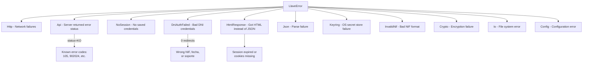

### HTML Response Detection

A particularly insidious failure mode: when session cookies are missing or
expired, the AEAT server doesn't return a JSON error. Instead, it returns an HTML
login page with HTTP 200. The client detects this by checking if the response
body starts with `<!DOCTYPE` or `<html`:

```rust
let trimmed = body.trim_start();
if trimmed.starts_with("<!DOCTYPE") || trimmed.starts_with("<html") {
    return Err(LlaveError::HtmlResponse { endpoint });
}
```

### DNI Auth Failure Detection

The `AutenticaDniNieContrasteh` endpoint doesn't return a JSON error on failure.
Instead, it returns the login form again (HTTP 200, no redirect). The client
detects this by counting redirects — a successful authentication always produces
at least one redirect:

```rust
if redirect_count == 0 {
    return Err(LlaveError::DniAuthFailed);
}
```

---

## Critical Implementation Notes

### 1. Manual Cookie Management

The client **must not** use the HTTP client's built-in cookie store. Standard
cookie stores follow RFC domain-matching rules, which prevent `www2` cookies from
being sent to `www6` or `www12`. The Android app uses `CookiePolicy.ACCEPT_ALL`
and a custom cookie jar that forwards all cookies to all subdomains.

### 2. Manual Redirect Following

Automatic redirects **must be disabled**. Cross-origin redirects (www2 → www12)
cause HTTP clients to strip custom headers (`Cookie`, `TrazasApp`) for security.
The client must follow each redirect manually, re-attaching all headers.

### 3. JSESSIONID Stripping for www6

The `JSESSIONID` cookie from www2's WebSphere cluster **must be explicitly
removed** before calling www6's `ClaveActivateAuthenticationSv`. Sending a
`JSESSIONID` from a different cluster causes www6 to return its homepage HTML.

### 4. Empty POST for ObtenerClaveMovilSMS

The SMS request endpoint expects a bare POST with no body and no Content-Type.
This matches Retrofit's `@POST` annotation without `@FormUrlEncoded`. Sending
even an empty form (`Content-Type: application/x-www-form-urlencoded` with empty
body) triggers error 902024.

### 5. User-Agent Completeness

The full Dalvik user-agent suffix including the parenthetical device info is
required. A truncated User-Agent causes the server's WAF/reverse proxy to reject
the request with a "page not enabled on public internet" error. This is the AEAT
server's primary mechanism for ensuring only the official mobile app can access
the API.

### 6. KO 105 from ClaveStartingSv

A KO response with code 105 from `ClaveStartingSv` is **expected** during new
device registration. The important side effect is the `appmovil` cookie being
set. The flow continues regardless.

### 7. TrazasApp Header

The custom `TrazasApp` header must be sent with every request. It contains a JSON
serialisation of the current cookie state. While the server may not strictly
validate every field, omitting the header entirely may cause requests to be
rejected.

### 8. Cookie Serialization Between Phases

Because Phase 1 and Phase 2 may be separated by user interaction time (entering
the SMS code), the cookies must be serialised to JSON after Phase 1 and
deserialised before Phase 2. This ensures the session state is preserved even if
the HTTP client is destroyed and recreated between phases.

---

## Endpoint Reference Table

| # | Endpoint | Subdomain | Path | Method | Body | Purpose |
|---|----------|-----------|------|--------|------|---------|
| 0 | `ClaveStartingSv` | www2 | `/wlpl/MOVI-P24H/` | POST | Form | Device context + appmovil cookie |
| 1 | `AutenticaDniNieContrasteh` | www2 | `/wlpl/BUCV-JDIT/` | POST | Form | DNI/NIE weak auth (returns HTML) |
| 2 | `ClaveRequestStateSv` | www12 | `/wlpl/MOVI-P24H/` | POST | Form | Registration state check |
| 3 | `ObtenerClaveMovilSMS` | www12 | `/wlpl/MOVI-P24H/` | POST | **Empty** | Trigger SMS code |
| 4 | `ValidarClaveMovilSMS` | www12 | `/wlpl/MOVI-P24H/` | POST | Form | Validate SMS code (sets pin24H) |
| 5 | `ClaveActivateAuthenticationSv` | www6 | `/wlpl/MOVI-P24H/` | POST | Form | Device activation (no JSESSIONID!) |

---

## Architecture Diagram

### System Architecture

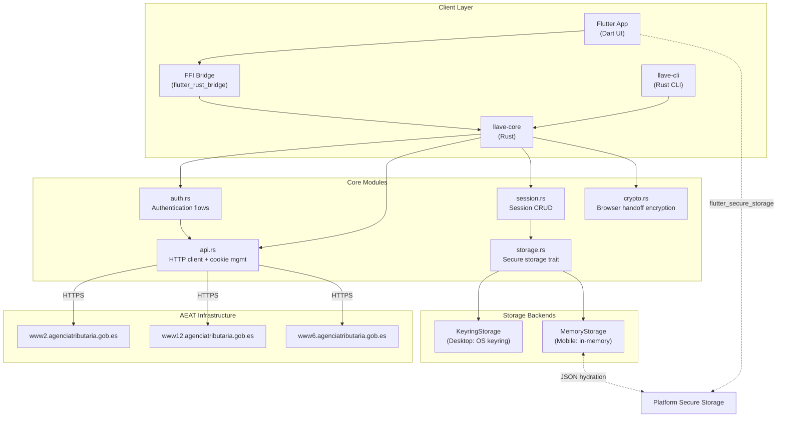

### Data Flow: DNI/NIE + SMS Activation

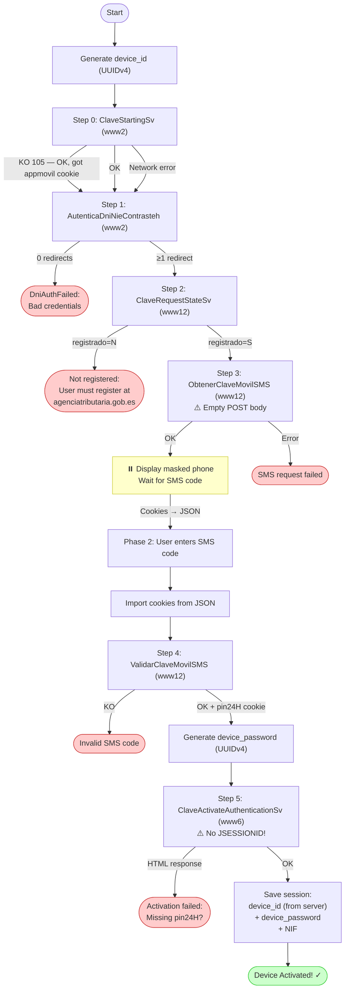
